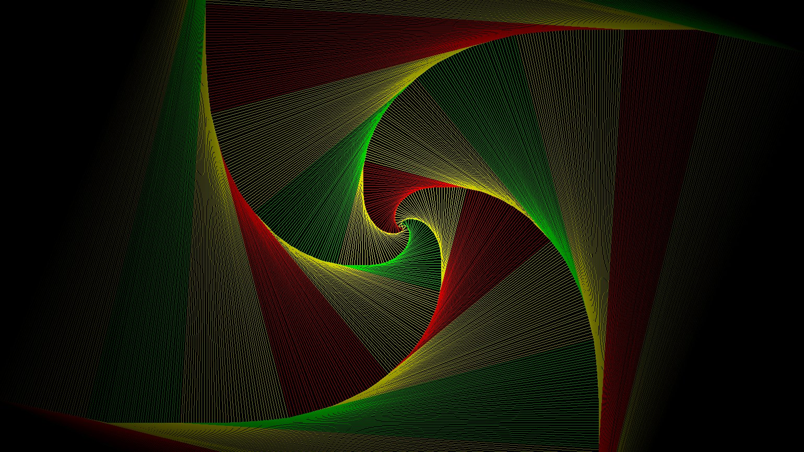

# Turtles All the Way Down

Create spiral images with varying colors. 
Set configurations in spiral_drawing.py to create different patterns

## Spirals are started by drawing squares such that each side goes just past the following corner

## In the next iteration, the endpoints of the sides are the new corners, with each line being drawn just past the next corner

## A couple iterations later

  
  
## Different color schemes can be chosen to create a more vibrant picture

  
  
## Apply a gradient using the shad configuration to create a fading effect

  
  
## Set the rotate configuration to create rotating colors
{width=50%}.

