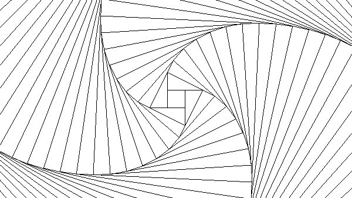

# Turtles All the Way Down
Create spiral images using the pygame library.
Generate different drawings based on configurations in spiral_drawing.py

## Building a Spiral
#### Spirals are started by drawing squares such that each side goes just past the following corner

#### In the next iteration, the endpoints of the sides are the new corners, with each line being drawn just past the next corner

#### A couple iterations later

  
## Configuration settings
#### Different color schemes can be chosen to create a more vibrant picture

#### Apply a gradient using the shad configuration to create a fading effect

#### Set the rotate configuration to create rotating colors

